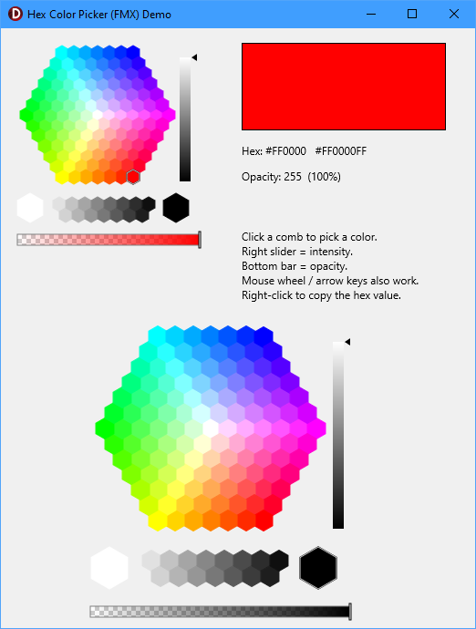

# TRhoHexColorPicker (FMX)

A honeycomb / hexagonal **color picker control for FireMonkey (FMX)**, with an
intensity slider, an opacity (alpha) bar, and a right-click "copy hex" menu. It is
a FireMonkey port of the classic VCL `TRhoHexaColorPicker` from mbColorLib.

> Built and tested with **Delphi 13 (RAD Studio 37.0)**, Win32 and Win64.

<!-- Add a screenshot here, e.g.  -->

## Features

- Hexagonal grid of color "combs" with a separate black-to-white strip.
- **Intensity slider** (0–100%) that re-shades the whole grid, with a smooth
  gradient and arrow or rectangle marker.
- **Opacity / alpha bar** with a checkerboard + gradient preview; the selected
  color is a full **ARGB** value.
- **Right-click copy menu** with three live formats: `#RRGGBB`, `#RRGGBBAA`,
  and `$AARRGGBB` (Delphi `TAlphaColor` literal).
- Mouse-wheel and arrow-key navigation; live hover hint (RGB / hex).
- Pure RTL + FMX — no external dependencies.
- Works at design time on Win32 and Win64; usable in code with zero install.

## Requirements

- RAD Studio / Delphi with FireMonkey (developed on Delphi 13 / 37.0).
- Windows (Win32 + Win64). The drawing is standard FMX `TCanvas`, so other FMX
  platforms are likely workable but untested.

## Screenshot



## Installation (design-time component)

The component ships as a runtime + design-time package pair.

1. Open `Package/RhoHexColorPickerFmx.groupproj`.
2. With platform **Win32** selected, **Build** `RhoHexColorPickerFmxRT` (the runtime
   package), then build it again for **Win64** if you target 64-bit apps.
3. Build `RhoHexColorPickerFmxDT` (the design package, Win32).
4. Right-click `RhoHexColorPickerFmxDT` ▸ **Install**.

`TRhoHexColorPicker` appears on the Tool Palette under **Rhody Components**.

To use it in your applications, add the `Source` folder to **Tools ▸ Options ▸
Language ▸ Delphi ▸ Library ▸ Library path** (per platform), or add
`Source/RhoHexColorPickerFmx.pas` to your project directly.

### Notes

- The IDE is 32-bit, so the **design package and a Win32 build of the runtime
  package are required to install**; build the runtime for Win64 as well so 64-bit
  apps can link it.
- If the component is **greyed out for Win64** on the palette, rebuild the **Win32**
  runtime package and reinstall the design package (the platform support comes from
  `[ComponentPlatformsAttribute]` on the class, read from the Win32 runtime BPL).
- **Coexistence with the original VCL mbColorLib:** this control was deliberately
  named `TRhoHexColorPicker` / unit `uRhoHexColorPickerFmx` (dropping the "a") so it does
  **not** collide with the VCL `THexaColorPicker` / `HexaColorPicker` unit in
  `mbColorLibDXE8`. Both can be installed at the same time.

## Quick start

### Design time
Drop a `TRhoHexColorPicker` on an FMX form and handle `OnChange`:

```pascal
procedure TForm1.RhoHexColorPicker1Change(Sender: TObject);
begin
  Rectangle1.Fill.Color := RhoHexColorPicker1.SelectedColor;
  Caption := RhoHexColorPicker1.HexRGB;     // e.g. '#3C8DC0'
end;
```

### In code (no install required)
Add `RhoHexColorPickerFmx` to `uses` and create it at runtime:

```pascal
uses uHexColorPickerFmx;

var
  Picker: TRhoHexColorPicker;
begin
  Picker := TRhoHexColorPicker.Create(Self);
  Picker.Parent := Self;                 // required, or it won't show
  Picker.Position.Point := PointF(16, 16);
  Picker.SelectedColor := TAlphaColors.Red;
  Picker.OnChange := PickerChange;
end;
```

A runnable demo is included (`Demo/DemoProject.dproj`, form `DemoMain`) — it builds the control in
code and shows a live swatch, hex readout, and opacity, so you can try the control
without installing the package.

## API

### Properties
| Property | Type | Notes |
|---|---|---|
| `SelectedColor` | `TAlphaColor` | The committed color (ARGB, includes alpha). |
| `SelectedAlpha` | `Byte` | Opacity 0–255 (default 255). |
| `Intensity` | `Integer` | Center intensity 0–100 (default 100). |
| `IntensityIncrement` | `Integer` | Wheel/key step (default 1). |
| `SliderVisible` | `Boolean` | Show the intensity slider (default True). |
| `OpacityVisible` | `Boolean` | Show the opacity bar (default True). |
| `SliderMarker` | `TMarker` | `smArrow` or `smRect`. |
| `NewArrowStyle` | `Boolean` | Alternate arrow marker. |
| `SliderWidth` | `Integer` | Slider width in px (default 12). |
| `BackgroundColor` | `TAlphaColor` | Fill behind the combs (`claNull` = transparent). |
| `IntensityText` | `string` | Label used in the intensity hint. |
| `HintFormat` | `string` | Hover hint template (`%r %g %b %hex`). |
| `ColorUnderCursor` | `TAlphaColor` | Read-only; color under the mouse. |

### Events
| Event | Fires when |
|---|---|
| `OnChange` | The selected color changes. |
| `OnIntensityChange` | The intensity slider moves. |
| `OnAlphaChange` | The opacity bar moves. |

### Methods
| Method | Returns |
|---|---|
| `HexRGB` / `HexRGBA` / `HexARGB` | `string` — selected color as `#RRGGBB` / `#RRGGBBAA` / `$AARRGGBB`. |
| `CopyHexToClipboard` | Copies `#RRGGBB` via `IFMXClipboardService`. |
| `GetColorAtPoint(X, Y)` / `GetHexColorAtPoint(X, Y)` | Color / hex at a local point. |
| `GetHexColorUnderCursor` | Hex of the color under the cursor. |
| `SelectCombIndex(i)` / `GetSelectedCombIndex` | Select / read by comb tab index. |

## Project layout

```
Source/
  RhoHexColorPickerFmx.pas        the control (TRhoHexColorPicker)
  RhoHexColorPickerFmxReg.pas     design-time Register (palette: "Rhody Components")
Package/
  RhoHexColorPickerFmxRT.dpk      runtime package
  RhoHexColorPickerFmxDT.dpk      design-time package (install this)
  RhoHexColorPickerFmx.groupproj  project group (build RT -> DT)
Demo/
  DemoProject.dproj            in-code demo project
  DemoMain.pas / .fmx          in-code demo form
```

## Credits & license

Derived from **mbColorLib** (the VCL color-picker library by Werner Lehmann /
MXS). The hexagonal comb-layout math is from the original; the FireMonkey
rendering, input handling, opacity bar, and copy menu are the FMX port.

Retain the original mbColorLib license terms for the derived portions. Add your
chosen license for this distribution here (e.g. MPL/MIT) before publishing.
